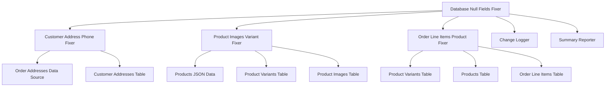

# Design Document

## Overview

This design addresses three critical database null field issues in the Lavish Library database:
1. Missing phone numbers in customer_addresses table
2. Empty variant_ids arrays in product_images table  
3. Missing product_id references in order_line_items table

The solution leverages existing JSON data sources and cross-table relationships to populate missing fields while maintaining data integrity and providing comprehensive logging.

## Architecture

### System Components



### Data Flow

1. **Customer Address Phone Resolution**:
   - Query customer_addresses for NULL phone numbers
   - Cross-reference with order_addresses via customer_id
   - Update customer_addresses with found phone numbers

2. **Product Images Variant Resolution**:
   - Query product_images for empty variant_ids arrays
   - Lookup product variants for each product_id
   - Populate variant_ids array with appropriate variant IDs

3. **Order Line Items Product Resolution**:
   - Query order_line_items for NULL product_id values
   - Use variant_id to lookup product_id from product_variants
   - Use SKU matching as fallback method
   - Use title similarity matching as final fallback

## Components and Interfaces

### DatabaseNullFieldsFixer Class

```python
class DatabaseNullFieldsFixer:
    def __init__(self, db_path: str = "7fa66cac/lavish_test.db")
    def get_connection(self) -> sqlite3.Connection
    def fix_customer_address_phones(self) -> Dict[str, int]
    def fix_product_images_variants(self) -> Dict[str, int]  
    def fix_order_line_items_products(self) -> Dict[str, int]
    def generate_summary_report(self, results: Dict) -> str
```

### CustomerAddressPhoneFixer Class

```python
class CustomerAddressPhoneFixer:
    def __init__(self, connection: sqlite3.Connection)
    def find_addresses_without_phone(self) -> List[Tuple]
    def find_phone_from_orders(self, customer_id: str) -> Optional[str]
    def update_address_phone(self, address_id: str, phone: str) -> bool
    def process_all_addresses(self) -> Dict[str, int]
```

### ProductImagesVariantFixer Class

```python
class ProductImagesVariantFixer:
    def __init__(self, connection: sqlite3.Connection)
    def find_images_without_variants(self) -> List[Tuple]
    def get_product_variants(self, product_id: str) -> List[str]
    def update_image_variants(self, image_id: str, variant_ids: List[str]) -> bool
    def process_all_images(self) -> Dict[str, int]
```

### OrderLineItemsProductFixer Class

```python
class OrderLineItemsProductFixer:
    def __init__(self, connection: sqlite3.Connection)
    def find_items_without_product_id(self) -> List[Tuple]
    def get_product_id_from_variant(self, variant_id: str) -> Optional[str]
    def get_product_id_from_sku(self, sku: str) -> Optional[str]
    def get_product_id_from_title(self, title: str) -> Optional[str]
    def update_item_product_id(self, item_id: str, product_id: str) -> bool
    def process_all_items(self) -> Dict[str, int]
```

## Data Models

### Customer Address Phone Resolution

**Input**: customer_addresses records with phone IS NULL
**Process**: 
- Query order_addresses for matching customer_id
- Extract phone numbers from shipping/billing addresses
- Update customer_addresses.phone field

**Output**: Updated customer_addresses records with phone numbers

### Product Images Variant Resolution

**Input**: product_images records with variant_ids = '[]'
**Process**:
- Query product_variants for matching product_id
- Build variant_ids JSON array
- Update product_images.variant_ids field

**Output**: Updated product_images records with populated variant_ids

### Order Line Items Product Resolution

**Input**: order_line_items records with product_id IS NULL
**Process**:
1. **Primary**: Use variant_id to lookup product_id from product_variants
2. **Secondary**: Use SKU to match variants and get product_id
3. **Tertiary**: Use title similarity to match products

**Output**: Updated order_line_items records with product_id values

## Error Handling

### Database Connection Errors
- Implement connection retry logic with exponential backoff
- Log connection failures with detailed error messages
- Gracefully handle database lock scenarios

### Data Integrity Errors
- Validate foreign key relationships before updates
- Check for duplicate entries before insertion
- Rollback transactions on constraint violations

### Missing Data Scenarios
- Log cases where no matching data is found
- Maintain statistics on unresolved records
- Provide recommendations for manual review

### JSON Parsing Errors
- Handle malformed variant_ids arrays gracefully
- Validate JSON structure before database updates
- Log parsing errors with record context

## Testing Strategy

### Unit Tests

1. **CustomerAddressPhoneFixer Tests**:
   - Test phone extraction from order addresses
   - Test phone number validation and formatting
   - Test update operations with various phone formats

2. **ProductImagesVariantFixer Tests**:
   - Test variant_ids array construction
   - Test JSON serialization/deserialization
   - Test single vs multi-variant scenarios

3. **OrderLineItemsProductFixer Tests**:
   - Test variant_id to product_id resolution
   - Test SKU matching algorithms
   - Test title similarity matching with fuzzy logic

### Integration Tests

1. **Database Integration Tests**:
   - Test with real database schema and sample data
   - Verify foreign key constraint handling
   - Test transaction rollback scenarios

2. **Cross-Table Relationship Tests**:
   - Verify customer_id relationships between tables
   - Test product_id/variant_id relationships
   - Validate data consistency after updates

### Data Quality Tests

1. **Before/After Validation**:
   - Compare null counts before and after processing
   - Verify no data corruption during updates
   - Validate referential integrity maintenance

2. **Edge Case Testing**:
   - Test with empty database tables
   - Test with malformed data entries
   - Test with missing foreign key references

### Performance Tests

1. **Large Dataset Testing**:
   - Test with thousands of records
   - Measure processing time and memory usage
   - Verify batch processing efficiency

2. **Concurrent Access Testing**:
   - Test database locking behavior
   - Verify transaction isolation
   - Test rollback scenarios under load

## Implementation Approach

### Phase 1: Customer Address Phone Resolution
- Implement CustomerAddressPhoneFixer class
- Create phone extraction logic from order addresses
- Add phone number validation and formatting
- Implement update operations with logging

### Phase 2: Product Images Variant Resolution  
- Implement ProductImagesVariantFixer class
- Create variant lookup logic from product_variants table
- Add JSON array construction and validation
- Implement batch update operations

### Phase 3: Order Line Items Product Resolution
- Implement OrderLineItemsProductFixer class
- Create multi-tier resolution strategy (variant_id → SKU → title)
- Add fuzzy matching for title similarity
- Implement comprehensive logging for unresolved items

### Phase 4: Integration and Testing
- Integrate all fixers into main DatabaseNullFieldsFixer class
- Add comprehensive error handling and logging
- Create summary reporting functionality
- Implement rollback capabilities for failed operations

## Data Sources and Dependencies

### Existing Database Tables
- **customer_addresses**: Target table for phone updates
- **order_addresses**: Source for phone number data
- **product_images**: Target table for variant_ids updates
- **product_variants**: Source for variant relationship data
- **order_line_items**: Target table for product_id updates
- **products**: Source for product information and title matching

### JSON Data Files (Reference Only)
- **orders/*.json**: Historical order data for validation
- **products/*.json**: Product and variant data for validation
- **customer/*.json**: Customer data for validation

### External Dependencies
- **sqlite3**: Database connectivity and operations
- **json**: JSON parsing and serialization
- **difflib**: Text similarity matching for title resolution
- **logging**: Comprehensive operation logging
- **datetime**: Timestamp generation for audit trails