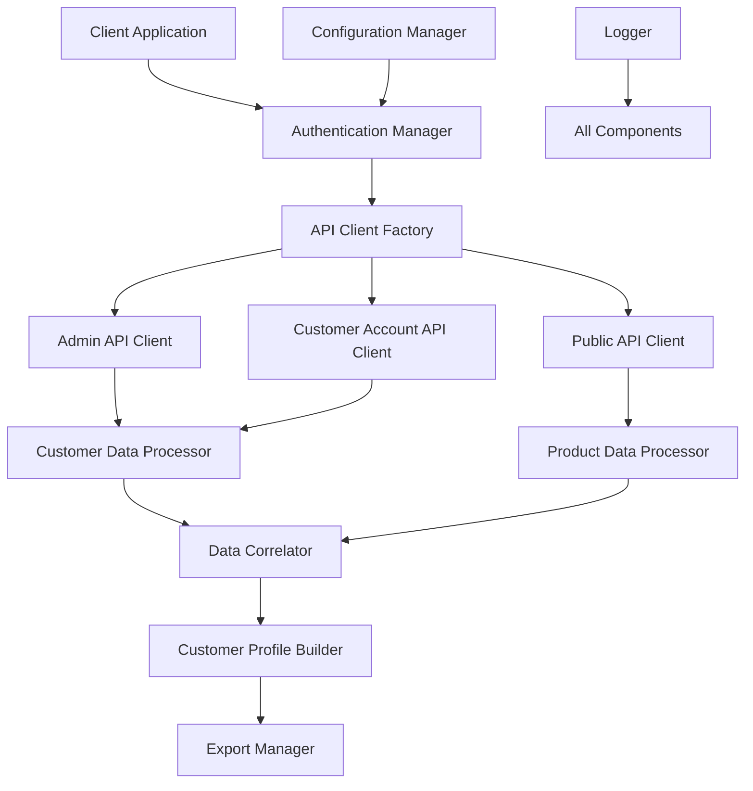

# Design Document

## Overview

The Shopify Customer Integration system provides a comprehensive solution for accessing, processing, and analyzing customer data from Shopify stores. The system handles multiple authentication methods, implements robust error handling, and provides fallback mechanisms when direct customer data access is unavailable.

The architecture supports both Admin API and Customer Account API access patterns, with automatic detection of available authentication methods and graceful degradation when certain data sources are unavailable.

## Architecture

### High-Level Architecture



### Component Interaction Flow

1. **Authentication Manager** determines available authentication methods
2. **API Client Factory** creates appropriate API clients based on available credentials
3. **Data Processors** handle API-specific data retrieval and transformation
4. **Data Correlator** combines data from multiple sources
5. **Customer Profile Builder** creates comprehensive customer profiles
6. **Export Manager** handles data output and reporting

## Components and Interfaces

### Authentication Manager

**Purpose**: Manages multiple authentication strategies and determines the best available method.

**Interface**:
```python
class AuthenticationManager:
    def detect_auth_methods(self, shop_domain: str) -> List[AuthMethod]
    def get_credentials(self, auth_method: AuthMethod) -> Credentials
    def validate_credentials(self, credentials: Credentials) -> bool
    def setup_oauth_flow(self, shop_domain: str) -> OAuthConfig
```

**Responsibilities**:
- Detect available authentication methods (Admin API, Customer Account API, Public API)
- Validate credential formats and permissions
- Handle OAuth flow setup for Customer Account API
- Provide fallback authentication strategies

### API Client Factory

**Purpose**: Creates and configures API clients based on available authentication methods.

**Interface**:
```python
class APIClientFactory:
    def create_admin_client(self, credentials: AdminCredentials) -> AdminAPIClient
    def create_customer_account_client(self, credentials: OAuthCredentials) -> CustomerAccountAPIClient
    def create_public_client(self, shop_domain: str) -> PublicAPIClient
    def get_available_clients(self, shop_domain: str) -> List[APIClient]
```

### Customer Data Processor

**Purpose**: Handles customer data retrieval and processing from authenticated APIs.

**Interface**:
```python
class CustomerDataProcessor:
    def fetch_customer_data(self, client: APIClient, customer_id: str = None) -> CustomerData
    def process_graphql_response(self, response: dict) -> List[Customer]
    def handle_pagination(self, client: APIClient, query: str) -> Iterator[Customer]
    def validate_customer_data(self, customer: Customer) -> ValidationResult
```

### Product Data Processor

**Purpose**: Processes public product data to generate customer insights when direct customer data is unavailable.

**Interface**:
```python
class ProductDataProcessor:
    def fetch_public_products(self, shop_domain: str) -> List[Product]
    def analyze_price_preferences(self, products: List[Product]) -> PriceAnalysis
    def categorize_products(self, products: List[Product]) -> CategoryAnalysis
    def generate_customer_insights(self, products: List[Product]) -> CustomerInsights
```

### Data Correlator

**Purpose**: Combines data from multiple sources to create comprehensive customer profiles.

**Interface**:
```python
class DataCorrelator:
    def correlate_customer_orders(self, customer: Customer, products: List[Product]) -> Customer
    def enrich_customer_profile(self, customer: Customer, insights: CustomerInsights) -> Customer
    def merge_data_sources(self, admin_data: dict, account_data: dict) -> dict
    def resolve_data_conflicts(self, sources: List[DataSource]) -> dict
```

## Data Models

### Core Customer Model

```python
@dataclass
class Customer:
    id: str
    creation_date: datetime
    display_name: str
    first_name: Optional[str]
    last_name: Optional[str]
    email_address: Optional[EmailAddress]
    phone_number: Optional[PhoneNumber]
    image_url: Optional[str]
    tags: List[str]
    addresses: List[Address]
    default_address: Optional[Address]
    orders: List[Order]
    metafields: List[Metafield]
    store_credit_accounts: List[StoreCreditAccount]
    subscription_contracts: List[SubscriptionContract]
    company_contacts: List[CompanyContact]
    draft_orders: List[DraftOrder]
    last_incomplete_checkout: Optional[Checkout]
```

### Authentication Models

```python
@dataclass
class AdminCredentials:
    shop_domain: str
    access_token: str
    api_key: Optional[str]
    api_secret: Optional[str]

@dataclass
class OAuthCredentials:
    shop_domain: str
    access_token: str
    refresh_token: Optional[str]
    expires_at: Optional[datetime]
    scopes: List[str]

@dataclass
class AuthenticationResult:
    success: bool
    auth_method: AuthMethod
    credentials: Optional[Credentials]
    error_message: Optional[str]
    fallback_options: List[AuthMethod]
```

### Data Processing Models

```python
@dataclass
class CustomerInsights:
    price_preferences: PriceAnalysis
    category_interests: CategoryAnalysis
    purchase_patterns: PurchaseAnalysis
    geographic_data: GeographicAnalysis
    engagement_metrics: EngagementMetrics

@dataclass
class ProcessingResult:
    success: bool
    data: Optional[dict]
    source: DataSource
    timestamp: datetime
    error_details: Optional[ErrorDetails]
    metadata: dict
```

## Error Handling

### Error Classification

1. **Authentication Errors**
   - Invalid credentials
   - Expired tokens
   - Insufficient permissions
   - OAuth flow failures

2. **API Errors**
   - Rate limiting
   - Network timeouts
   - Invalid requests
   - Server errors

3. **Data Processing Errors**
   - Invalid data formats
   - Missing required fields
   - Correlation failures
   - Validation errors

### Error Handling Strategy

```python
class ErrorHandler:
    def handle_authentication_error(self, error: AuthError) -> ErrorResponse
    def handle_api_error(self, error: APIError) -> ErrorResponse
    def handle_rate_limit(self, error: RateLimitError) -> RetryStrategy
    def handle_data_error(self, error: DataError) -> ErrorResponse
    
    def get_fallback_strategy(self, error: Error) -> FallbackStrategy
    def log_error_context(self, error: Error, context: dict) -> None
```

### Retry and Fallback Mechanisms

- **Exponential backoff** for rate limiting
- **Circuit breaker pattern** for failing endpoints
- **Graceful degradation** to public data when authenticated access fails
- **Alternative authentication methods** when primary method fails

## Testing Strategy

### Unit Testing

- **Authentication Manager**: Test credential validation, OAuth flow setup, fallback strategies
- **API Clients**: Mock API responses, test error handling, validate request formatting
- **Data Processors**: Test data transformation, validation, pagination handling
- **Data Correlator**: Test data merging, conflict resolution, enrichment logic

### Integration Testing

- **End-to-end authentication flows** with test stores
- **API client integration** with real Shopify endpoints
- **Data processing pipelines** with sample data sets
- **Error handling scenarios** with simulated failures

### Test Data Strategy

- **Mock Shopify responses** for consistent unit testing
- **Test store environments** for integration testing
- **Sample customer data sets** for data processing validation
- **Error scenario simulations** for resilience testing

### Performance Testing

- **Rate limit handling** under high load
- **Memory usage** with large customer datasets
- **Processing time** for data correlation and enrichment
- **Concurrent request handling** for multiple stores

## Security Considerations

### Credential Management

- **Secure storage** of API credentials and tokens
- **Token refresh** handling for OAuth flows
- **Credential rotation** support
- **Environment-based configuration** for different deployment stages

### Data Privacy

- **Data anonymization** options for exports
- **PII handling** compliance with privacy regulations
- **Audit logging** for data access and processing
- **Data retention policies** for processed customer data

### API Security

- **Request signing** for Admin API calls
- **HTTPS enforcement** for all API communications
- **Input validation** for all user-provided data
- **Rate limit compliance** to avoid API abuse

## Configuration Management

### Environment Configuration

```python
@dataclass
class ShopifyConfig:
    shop_domain: str
    admin_credentials: Optional[AdminCredentials]
    oauth_config: Optional[OAuthConfig]
    api_version: str = "2023-10"
    rate_limit_strategy: RateLimitStrategy = RateLimitStrategy.EXPONENTIAL_BACKOFF
    retry_attempts: int = 3
    timeout_seconds: int = 30
```

### Feature Flags

- **Enable/disable** specific authentication methods
- **Toggle** data enrichment features
- **Control** export formats and destinations
- **Manage** logging levels and detail

This design provides a robust, scalable foundation for Shopify customer data integration that handles the complexities of multiple authentication methods, provides comprehensive error handling, and ensures data quality through validation and correlation processes.